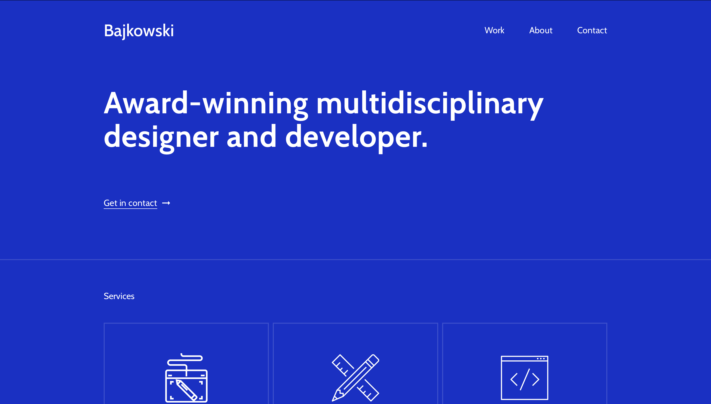
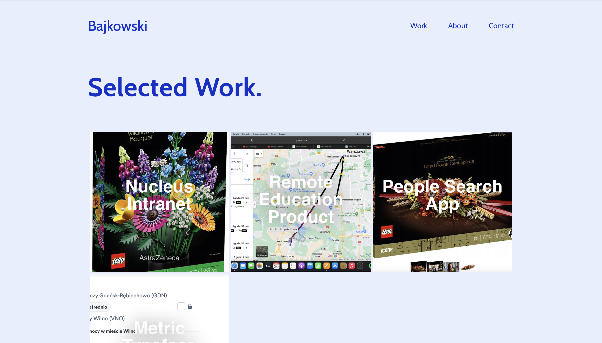
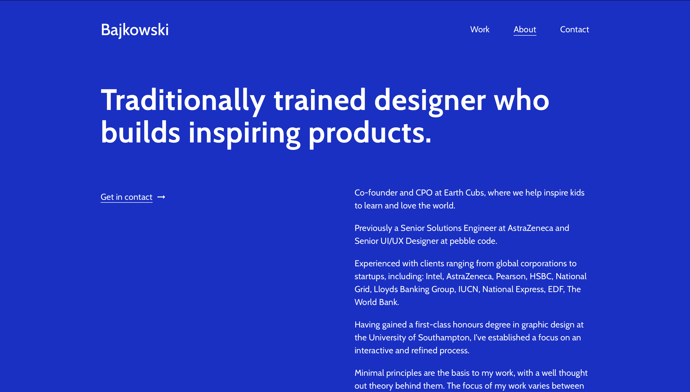
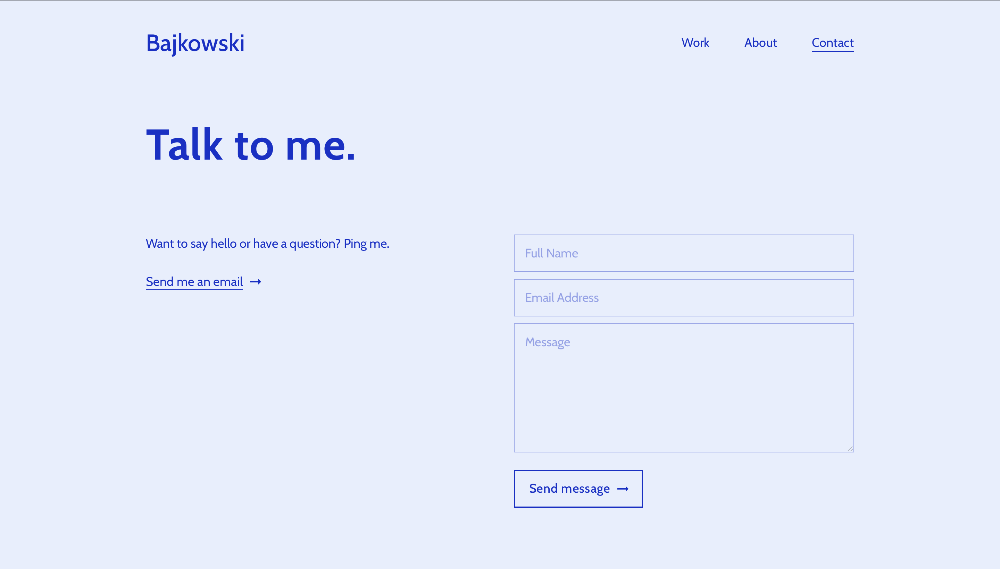

# Personal Website
> Personal Website is a responsive design based on the React library that allows users to see my projects and contact me>
>
> Live demo [here]()

## Table of Contents
* [General Info](#general-information)
* [Technologies Used](#technologies-used)
* [Screenshots](#screenshots)
* [Setup](#setup)
* [Usage](#usage)
* [Project Status](#project-status)
* [Room for Improvement](#room-for-improvement-and-development)
* [Acknowledgements](#acknowledgements)
* [Contact](#contact)
* [License](#license)

## General Information
- Detailed presentation of the projects.
- A place to get to know me and contact me.
- Small project designed to improve skills.

## Technologies Used
- **@emotion/react** (version ^11.11.3) - A popular JavaScript library for styling React components.
- **@emotion/styled** (version ^11.11.0) - A JavaScript library for styling React components with JavaScript.
- **@formspree/react** (version ^2.5.1) - A library for integrating Forms with React using Formsprée.
- **@mui/icons-material** (version ^5.15.2) - Material-UI icons for React.
- **@mui/material** (version ^5.15.2) - A React UI framework that follows Google's Material Design.
- **@testing-library/jest-dom** (version ^5.17.0) - Custom Jest matchers for testing DOM elements.
- **@testing-library/react** (version ^13.4.0) - A simple and complete testing library for React.
- **@testing-library/user-event** (version ^13.5.0) - Custom React events for testing.
- **axios** (version ^1.6.3) - A promise-based HTTP client for the browser and Node.js.
- **dotenv** (version ^16.3.1) - A zero-dependency module for loading environment variables.
- **prop-types** (version ^15.8.1) - Runtime type checking for React props.
- **react** (version ^18.2.0) - A JavaScript library for building user interfaces.
- **react-dom** (version ^18.2.0) - ReactDOM library for React.
- **react-router-dom** (version ^6.21.1) - Declarative routing for React.js.
- **react-scripts** (version 5.0.1) - Scripts and configuration used by Create React App.
- **sass** (version ^1.69.5) - Syntactically Awesome Stylesheets for styling web pages.
- **styled-components** (version ^6.1.6) - A popular library for styling React components with tagged template literals.
- **web-vitals** (version ^2.1.4) - Library for measuring web vitals.

## Screenshots

**Fragment Landing Page**

***Selected Work**

**About**

**Contact**

**Fragment of one of the project pages**

## Setup
In this project, everything required to run and work with this project is included in the **package.json** file

## Usage
To get started with the "personal-website" project, follow these steps:

1. **Clone the repository**: Clone this repository to your computer using the following command:
`git clone https://github.com/lukaszbajkowski/personal-website.git`
2. **Navigate to the project directory**:
`cd personal-website`
3. **Install dependencies**: Use the following command to install all the required project dependencies:
`npm install`
4. **Run the project**:
`npm start`
5. **Open your browser** and go to [http://localhost:3000](http://localhost:3000) to use the "Lingo" application.
6. **Customize the project**: You can customize the project by editing components, styles, and adding your own features to meet your needs.
7. **Publish the project**: When you're ready to deploy the project, you can run the build process to create an optimized production-ready version: `npm run build`

The finished project files will be available in the `build` directory.

That's it! You are now ready to start working with the "personal-website" project. Good luck!

## Project Status
Current status of the project: _completed but with room to grow_

## Room for Improvement and Development
At the moment, some image files need improvement. They do not all have the same extension. The extension of the project logo needs to be changed to a file with the extension .svg. In addition, the frames for the animations contained in the ScrollingSection need to be created in order to provide the right fluidity for them.

Room for improvement:
- Implementation of automatic filter for images with page color
- Optimization and improvement of minor bugs.

To do:
- Implementation of using to store database data instead of constants in a file.
- Creation of a page for adding projects consisting of a clean project page with buttons for adding data.
- Filling in the page with real data instead of filling in from the page that inspired the design.

## Acknowledgements
Credit is to be given to
- The layout of this project was inspired by [PeterTait](https://petertait.com)
- For the inspiration to start a project for [pabiel](https://github.com/pabiel)

## Contact
Created by [@Łukasz Bajkowski](https://github.com/lukaszbajkowski) - feel free to contact me!

## License
This project is open source and available under the
[MPL-2.0 license](https://choosealicense.com/licenses/mpl-2.0/)